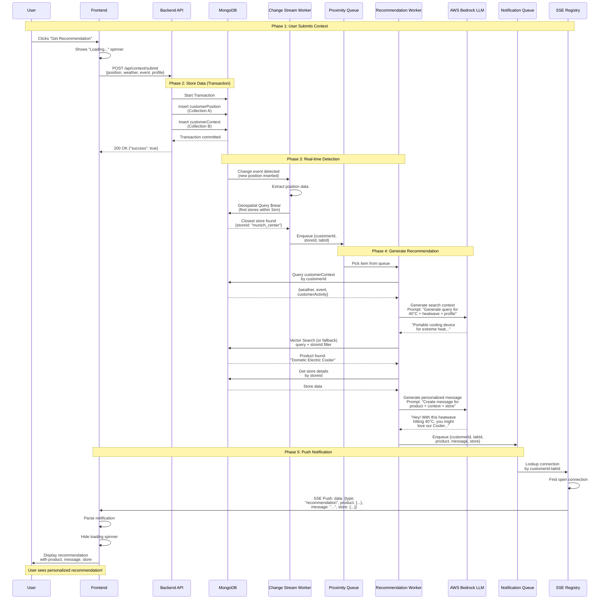
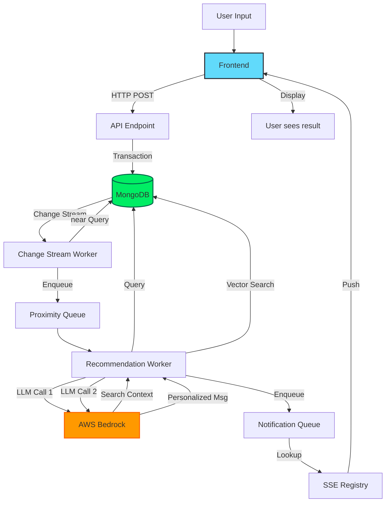
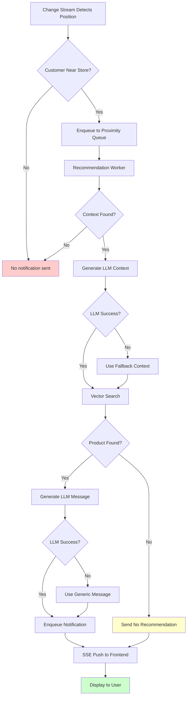
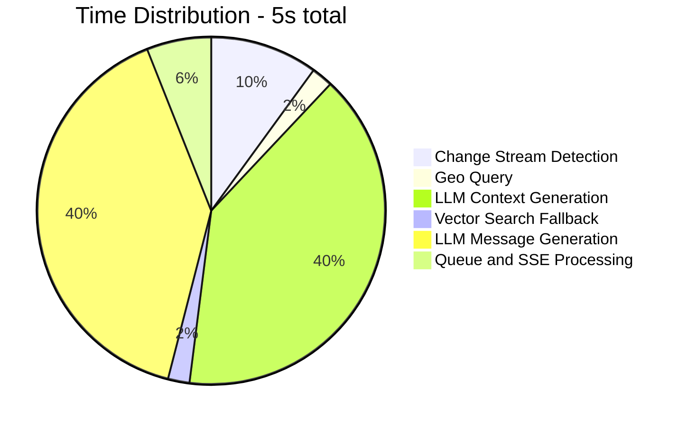
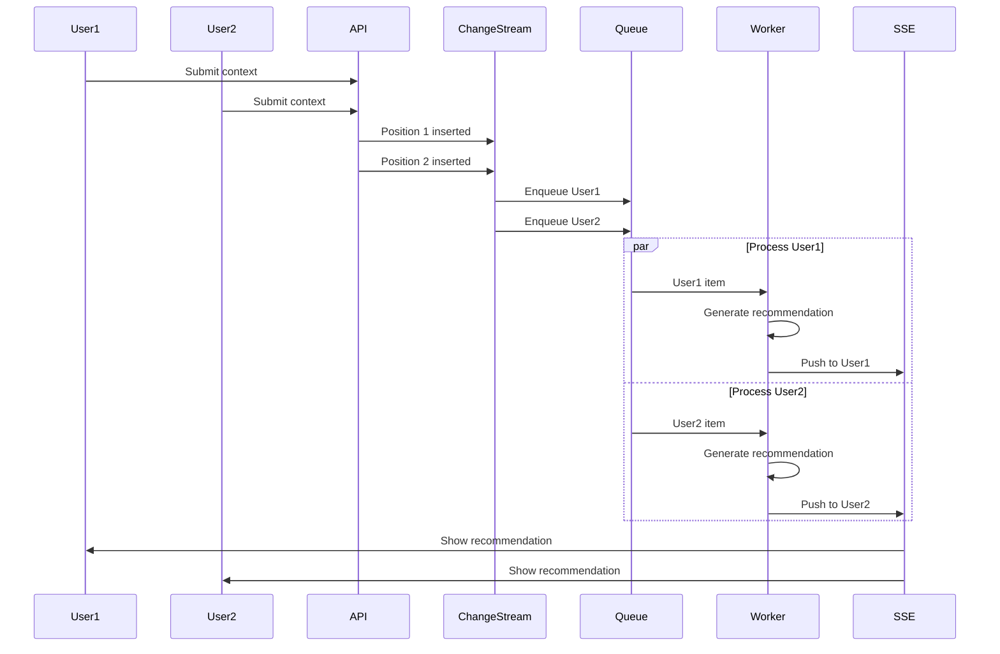
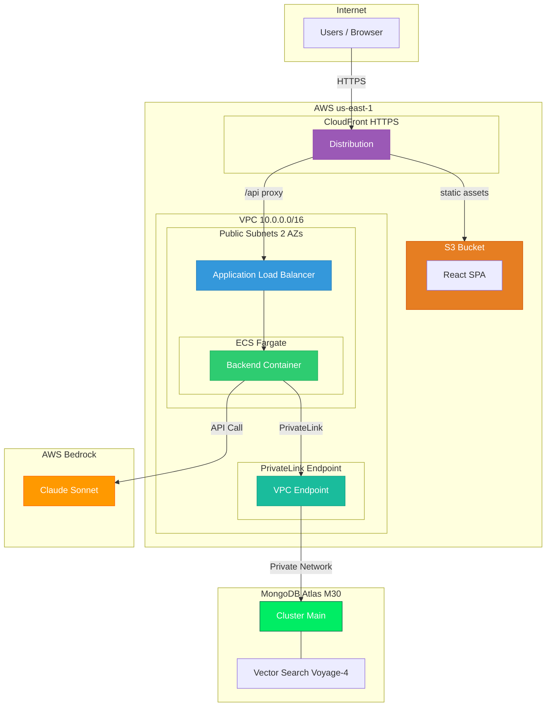
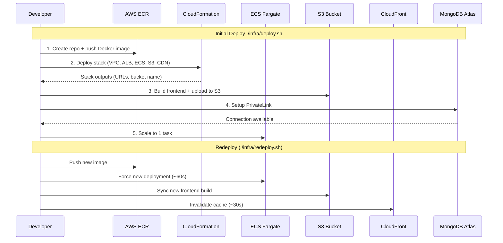
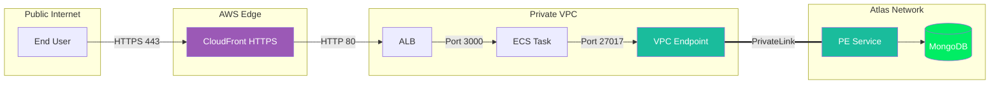
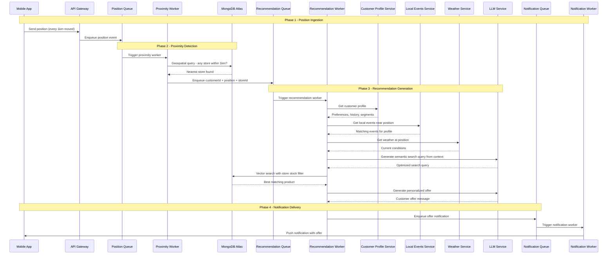
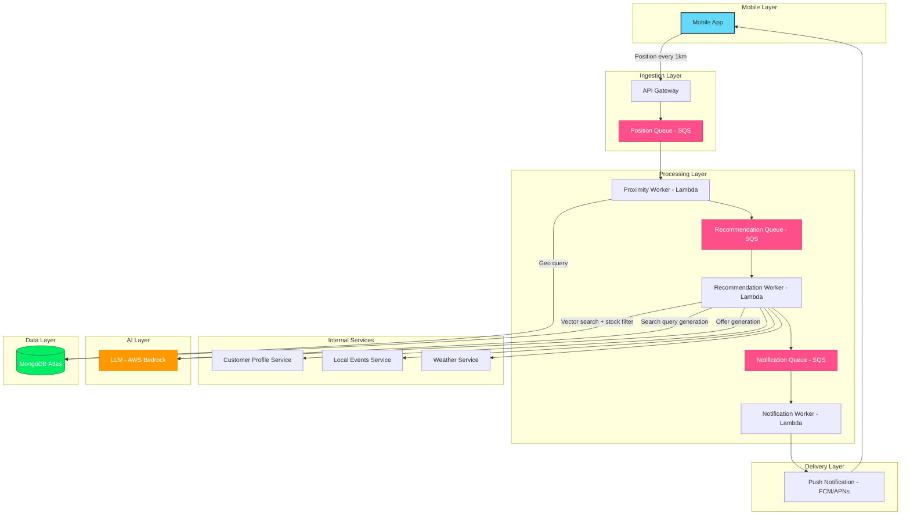

# System Flow Diagram

## Complete End-to-End Request Flow



## Flow Timeline

| Phase | Duration | Description |
|-------|----------|-------------|
| **1. User Submission** | ~50ms | Frontend POST to API |
| **2. Store Data** | ~100ms | MongoDB transaction (2 collections) |
| **3. Detection** | ~500ms | Change stream + geo query |
| **4. Recommendation** | ~4-5s | LLM context + search + LLM message |
| **5. Push Notification** | ~50ms | SSE to frontend |
| **Total** | **~5s** | Button click to displayed result |

## Key Points

### 1. Non-blocking API Response
The API returns immediately after storing data. Processing happens asynchronously via workers.

### 2. Real-time Change Detection
MongoDB Change Streams provide instant notification of new positions (no polling required).

### 3. Geospatial Intelligence
The `$near` query uses the 2dsphere index to find stores within 1km radius efficiently.

### 4. Dual LLM Calls
- **First call**: Generates semantic search query from context
- **Second call**: Personalizes the message for the customer

### 5. Queue-based Processing
In-memory queues decouple event detection from processing:
- **Proximity Queue**: Holds customers near stores
- **Notification Queue**: Holds ready recommendations

### 6. SSE Push Architecture
Server maintains open connections and pushes notifications (not HTTP polling).

## Detailed Flow by File

### Frontend
```
src/components/SimulationPanel.tsx
  └─> src/services/api.service.ts (submitContext)
      └─> POST http://localhost:3000/api/context/submit

src/App.tsx (useEffect)
  └─> src/services/api.service.ts (connectSSE)
      └─> EventSource connection to /api/notifications/stream/:id/:tab
          └─> Receives SSE messages
              └─> src/components/RecommendationDisplay.tsx (renders)
```

### Backend
```
src/routes/api.routes.ts (POST /context/submit)
  └─> MongoDB transaction (2 collections)
      
src/workers/changestream.worker.ts
  └─> Watches customerPosition collection
      └─> Executes $near query on stores
          └─> Enqueues to proximityQueue
          
src/workers/recommendation.worker.ts (processes proximityQueue)
  └─> Queries customerContext
      └─> src/services/llm.service.ts (generateSearchContext)
          └─> AWS Bedrock LLM call #1
      └─> src/services/vector-search.service.ts (findBestProduct)
          └─> MongoDB vector search (or fallback)
      └─> src/services/llm.service.ts (generatePersonalizedMessage)
          └─> AWS Bedrock LLM call #2
      └─> Enqueues to notificationQueue
      
src/services/notification.service.ts (processes notificationQueue)
  └─> Looks up SSE connection by customerId-tabId
      └─> Writes to Express Response stream
```

## Alternative View: Data Flow



## Error Handling Flow



## Performance Bottlenecks



The two LLM calls account for ~80% of the total time. These can be optimized by:
- Using faster models (e.g., Claude Haiku)
- Caching common contexts
- Pre-generating message templates
- Running LLM calls in parallel where possible

## Concurrent Users Flow



The queue-based architecture allows concurrent processing of multiple customers without blocking.

## AWS Deployment Architecture

The production deployment uses AWS services with MongoDB Atlas PrivateLink for secure, low-latency connectivity.



### Deployment Flow



### Network Security



Key security properties:
- **No public MongoDB access** — Atlas cluster has no 0.0.0.0/0 in the IP access list
- **Traffic stays on AWS backbone** — PrivateLink uses AWS internal network, never traversing the internet
- **HTTPS everywhere** — CloudFront terminates TLS; backend communication is VPC-internal
- **No exposed credentials** — Secrets read from `.env` at deploy time, injected as ECS environment variables

## Production Architecture

In a production deployment, the system operates as an event-driven pipeline triggered by real-time mobile device location updates. Each stage is decoupled through message queues, enabling independent scaling and fault tolerance.

### Production Flow



### Production Component Diagram



### Production Pipeline Stages

| Stage | Trigger | Worker | Action | Output |
|-------|---------|--------|--------|--------|
| **1. Position Ingestion** | Mobile sends GPS every 1km | API Gateway | Validates and enqueues | Position event in queue |
| **2. Proximity Detection** | Position event | Lambda | Geospatial query against MongoDB stores | customerId + storeId + position |
| **3. Context Enrichment** | Proximity event | Lambda | Calls Profile, Events, Weather services | Full customer context |
| **4. Query Generation** | Enriched context | Lambda | LLM reasons about best search query | Semantic search query |
| **5. Product Matching** | Search query | Lambda | MongoDB Vector Search with stock filter | Best matching product |
| **6. Offer Generation** | Product + context | Lambda | LLM creates personalized offer | Customer offer message |
| **7. Notification** | Offer ready | Lambda | Push notification to mobile | User sees offer on phone |

### Demo vs Production Comparison

| Aspect | Demo (this repo) | Production |
|--------|-----------------|------------|
| **Position source** | Dropdown selector in browser | Mobile GPS every 1km |
| **Queues** | In-memory queues | AWS SQS / EventBridge |
| **Workers** | Node.js async functions | AWS Lambda (independent, scalable) |
| **Customer profile** | Dropdown selector | Internal Customer Profile Service |
| **Events** | Dropdown selector | Local Events Service (geo-aware) |
| **Weather** | Dropdown selector | Weather API (position-based) |
| **Notifications** | Server-Sent Events (SSE) | Push notifications (FCM/APNs) |
| **Scaling** | Single process | Each worker scales independently |
| **Fault tolerance** | None (restart loses state) | Dead-letter queues, retries, idempotency |

---

**See also:**
- [README.md](README.md) - Setup and overview
- [PLAN.md](PLAN.md) - Detailed architecture
- [STATUS.md](STATUS.md) - Current system state
- [TROUBLESHOOTING.md](TROUBLESHOOTING.md) - Common issues
