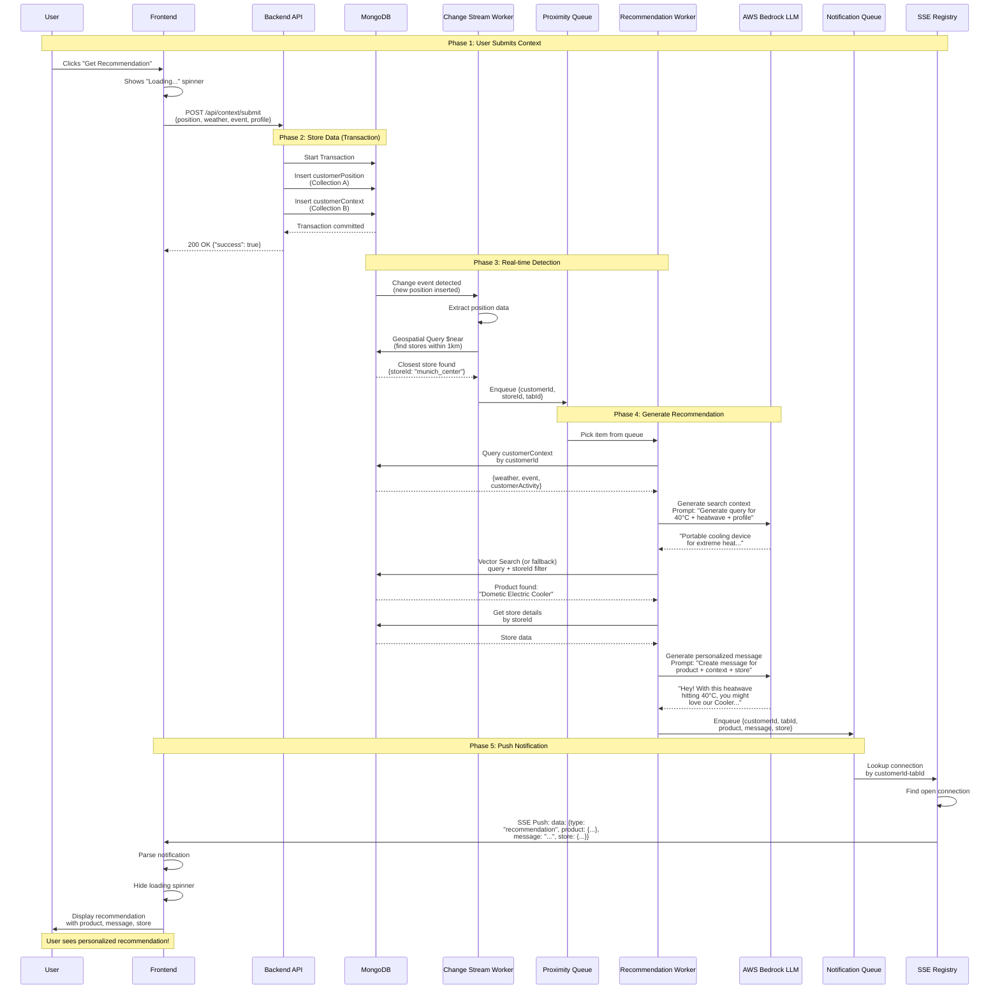
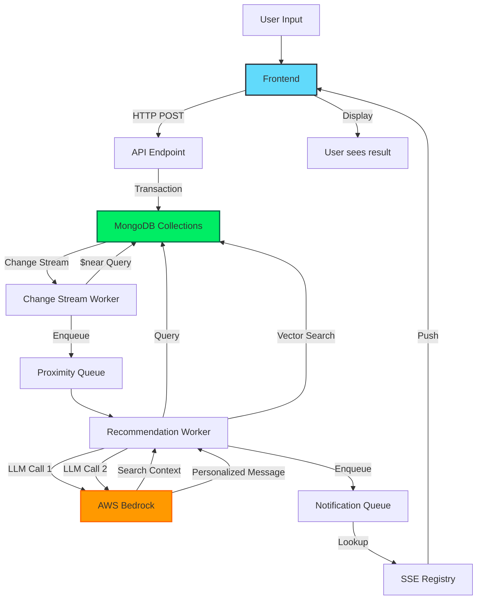
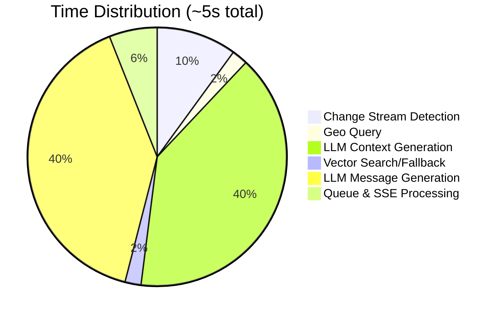
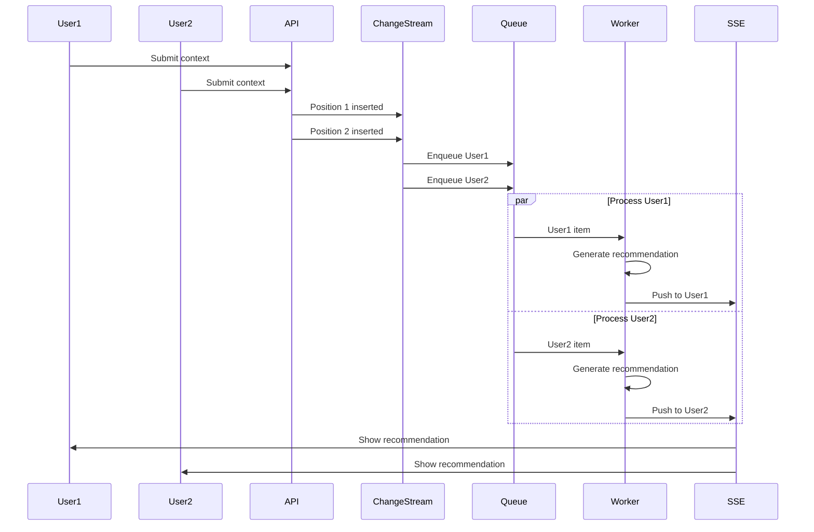

# System Flow Diagram

## Complete End-to-End Request Flow



## Flow Timeline

| Phase | Duration | Description |
|-------|----------|-------------|
| **1. User Submission** | ~50ms | Frontend POST to API |
| **2. Store Data** | ~100ms | MongoDB transaction (2 collections) |
| **3. Detection** | ~500ms | Change stream + geo query |
| **4. Recommendation** | ~4-5s | LLM context + search + LLM message |
| **5. Push Notification** | ~50ms | SSE to frontend |
| **Total** | **~5s** | Button click to displayed result |

## Key Points

### 1. Non-blocking API Response
The API returns immediately after storing data. Processing happens asynchronously via workers.

### 2. Real-time Change Detection
MongoDB Change Streams provide instant notification of new positions (no polling required).

### 3. Geospatial Intelligence
The `$near` query uses the 2dsphere index to find stores within 1km radius efficiently.

### 4. Dual LLM Calls
- **First call**: Generates semantic search query from context
- **Second call**: Personalizes the message for the customer

### 5. Queue-based Processing
In-memory queues decouple event detection from processing:
- **Proximity Queue**: Holds customers near stores
- **Notification Queue**: Holds ready recommendations

### 6. SSE Push Architecture
Server maintains open connections and pushes notifications (not HTTP polling).

## Detailed Flow by File

### Frontend
```
src/components/SimulationPanel.tsx
  └─> src/services/api.service.ts (submitContext)
      └─> POST http://localhost:3000/api/context/submit

src/App.tsx (useEffect)
  └─> src/services/api.service.ts (connectSSE)
      └─> EventSource connection to /api/notifications/stream/:id/:tab
          └─> Receives SSE messages
              └─> src/components/RecommendationDisplay.tsx (renders)
```

### Backend
```
src/routes/api.routes.ts (POST /context/submit)
  └─> MongoDB transaction (2 collections)
      
src/workers/changestream.worker.ts
  └─> Watches customerPosition collection
      └─> Executes $near query on stores
          └─> Enqueues to proximityQueue
          
src/workers/recommendation.worker.ts (processes proximityQueue)
  └─> Queries customerContext
      └─> src/services/llm.service.ts (generateSearchContext)
          └─> AWS Bedrock LLM call #1
      └─> src/services/vector-search.service.ts (findBestProduct)
          └─> MongoDB vector search (or fallback)
      └─> src/services/llm.service.ts (generatePersonalizedMessage)
          └─> AWS Bedrock LLM call #2
      └─> Enqueues to notificationQueue
      
src/services/notification.service.ts (processes notificationQueue)
  └─> Looks up SSE connection by customerId-tabId
      └─> Writes to Express Response stream
```

## Alternative View: Data Flow



## Error Handling Flow

```mermaid
flowchart TD
    A[Change Stream Detects Position] --> B{Customer<br/>Near Store?}
    B -->|No| C[No notification sent]
    B -->|Yes| D[Enqueue to Proximity Queue]
    D --> E[Recommendation Worker]
    E --> F{Context<br/>Found?}
    F -->|No| C
    F -->|Yes| G[Generate LLM Context]
    G --> H{LLM<br/>Success?}
    H -->|No| I[Use Fallback Context]
    H -->|Yes| J[Vector Search]
    I --> J
    J --> K{Product<br/>Found?}
    K -->|No| L[Send "No Recommendation"<br/>notification]
    K -->|Yes| M[Generate LLM Message]
    M --> N{LLM<br/>Success?}
    N -->|No| O[Use Generic Message]
    N -->|Yes| P[Enqueue Notification]
    O --> P
    P --> Q[SSE Push to Frontend]
    Q --> R[Display to User]
    L --> Q
    
    style C fill:#ffcccc
    style L fill:#ffffcc
    style R fill:#ccffcc
```

## Performance Bottlenecks



The two LLM calls account for ~80% of the total time. These can be optimized by:
- Using faster models (e.g., Claude Haiku)
- Caching common contexts
- Pre-generating message templates
- Running LLM calls in parallel where possible

## Concurrent Users Flow



The queue-based architecture allows concurrent processing of multiple customers without blocking.

---

**See also:**
- [README.md](README.md) - Setup and overview
- [PLAN.md](PLAN.md) - Detailed architecture
- [STATUS.md](STATUS.md) - Current system state
- [TROUBLESHOOTING.md](TROUBLESHOOTING.md) - Common issues
